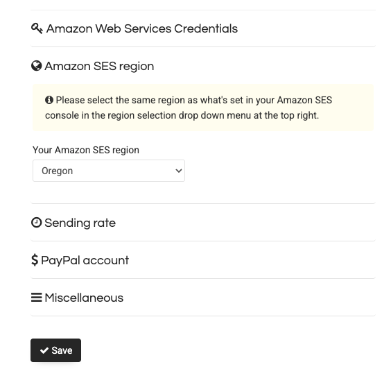

# template sendy app

A template for using [Sendy](https://sendy.co/), the newsletter app, with
a [Docker](https://docs.docker.com/) image, [fly.io](https://fly.io/)
as host, and a [Railway](https://railway.com/) database.

This uses a [Github Action](./.github/workflows/deploy.yml) to deploy
the site to fly.io on any push to the main branch.

<details><summary><h2>Contents</h2></summary>

<!-- toc -->

- [Use](#use)
- [Configure things](#configure-things)
  * [Set env vars](#set-env-vars)
  * [Install Fly.io helpers](#install-flyio-helpers)
  * [Install Sendy](#install-sendy)
  * [Configure Sendy](#configure-sendy)
- [Database](#database)
  * [Create](#create)
  * [Get the environment variables](#get-the-environment-variables)
- [Initialize Fly app](#initialize-fly-app)
  * [DNS](#dns)
  * [Setup [AWS SES](https://console.aws.amazon.com/ses/)](#setup-aws-seshttpsconsoleawsamazoncomses)
- [API Integration Example](#api-integration-example)

<!-- tocstop -->

</details>

## Use

1. Use the template button in github, then git clone and npm install.
   ```sh
   npm i && npm init
   ```
2. Replace this file with `README.example.md` and edit it
   so it is relevant. Change the URL for the badge.
   ```sh
   mv README.example.md README.md
   ```

## Configure things

### Set env vars

Change the filename, then edit the values.

```bash
mv .env.example .env
```

Be sure to set the variables on fly.io as well.


### Install Fly.io helpers

```sh
brew install flyctl
```

#### Login to Fly

```sh
flyctl auth login
```

### Install Sendy

After you buy Sendy, you should unzip it into this folder.

This template includes a Github action that will automatically deploy Sendy
on any git push to `main` branch.

To finish installing, you will need to go to your URL,
e.g. https://my-sendy-app.fly.dev/_install.php .


### Configure Sendy

#### Edit `includes/config.php`:

```php
$dbHost = getenv('DB_HOST');
$dbUser = getenv('DB_USER');
$dbPass = getenv('DB_PASS');
$dbName = getenv('DB_NAME');
$installation_url = 'https://<your-app>.fly.dev';
$aws_access_key_id = getenv('AWS_KEY');
$aws_secret_access_key = getenv('AWS_SECRET');
$aws_region = getEnv('AWS_REGION');  // or whatever SES region you're using
```

#### Edit `scheduled.php`

Require a valid cron key.

```php
<?php
	include('includes/config.php');

    // Protect cron endpoint
    $cron_key = getenv('CRON_KEY');
    if (!isset($_GET['cron_key']) || $_GET['cron_key'] !== $cron_key) {
        http_response_code(403);
        echo "Access denied";
        exit;
    }
```


#### Edit `.htaccess`

Add this line to prevent "clickjacking":

```
Header always set X-Frame-Options "SAMEORIGIN"
```

Add a redirect from fly.io to your domain:

```
# Redirect Fly.io default domain to custom domain
RewriteCond %{HTTP_HOST} ^sendy-app\.fly\.dev$ [NC]
RewriteRule ^(.*)$ https://newsletter.substratesystem.com/$1 [L,R=301]
```

Disable error logging in production:

```
php_flag display_errors off
php_value error_reporting 30711
```


-------


## Database

You need a mysql database, for example [Railway](https://railway.app/).


### Create

1. Go to [railway.app](https://railway.app/) and create a new project
2. Click "Deploy" -> "Database" -> "MySQL"
3. Wait for the database to provision


### Get the environment variables

In your Railway dashboard:

1. Click on your MySQL service
2. Go to the "Connect" tab
3. Copy the connection details:
   - `DB_HOST`
   - `DB_USER`
   - `DB_PASS`
   - `DB_PORT` (usually 3306)
   - `DB_NAME` ('railway')


## Initialize Fly app

```sh
flyctl launch --name my-sendy-app --dockerfile Dockerfile --no-deploy
```

### DNS

In your DNS service (Netlify or other), Create a CNAME record pointing to the
Sendy app on Fly, e.g.

```
newsletter.my-domain.com -> my-sendy-app.fly.dev
```

### Setup [AWS SES](https://console.aws.amazon.com/ses/)

#### Add these things

* SPF TXT record
* DKIM CNAMEs
* Optional: DMARC


#### Move out of the sandbox

You need to make a request to AWS for this.


#### AWS Region

[In the Sendy GUI](https://newsletter.my-domain.com/settings),
be sure thate the SES region is the same as the one in AWS.




-------


## API Integration Example

In your backend, for example a lambda function,
compare the local files with the published emails in Sendy, and email any
new ones. This would be appropriate for a function that runs any time
you deploy the site.

We connect to the database directly to get the published emails, so this
depends on the schema that Sendy uses.

```ts
import mysql from 'mysql2/promise'
import {
    getPublishedNotes,
    readLocalNotes,
} from '../util.js'

const connection = await mysql.createConnection({
    host: DB_HOST,
    user: DB_USER,
    port: parseInt(DB_PORT!),
    password: DB_PASSWORD,
    database: DB_NAME,
})

// Query Sendy's campaigns table to get notes that have already been emailed.
// This depends on the DB schema that Sendy uses.
const query = `
    SELECT title, html_text, sent 
    FROM campaigns 
    WHERE sent IS NOT NULL AND sent != ''
    ORDER BY id DESC
`

const [rows] = await connection.execute(query)
await connection.end()

/**
 * This function runs after each deployment to check for new notes
 * that need to be emailed to subscribers via Sendy.
 */
export default async function (_req: Request, _ctx: Context) {
    try {
        // Get all published notes from the database
        const publishedNotes = await getPublishedNotes()

        // Get all local notes from the site
        const localNotes = await readLocalNotes()

        // Find notes that exist locally but haven't been emailed yet
        const unpublishedNotes = localNotes.filter(localNote => {
            return !publishedNotes.some(publishedNote => {
                return publishedNote.slug === localNote.slug
            })
        })

        // Check if Sendy is configured
        if (
            !process.env.SENDY_API_URL ||
            !process.env.SENDY_API_KEY ||
            !process.env.SENDY_LIST_ID
        ) {
            console.error('Missing Sendy config')

            return new Response('Missing Sendy config', { status: 500 })
        }

        // Email each unpublished note via Sendy
        const emailResults:{
            note:string;
            success:boolean;
            response?:string;
            error?:string;
        }[] = []

        for (const note of unpublishedNotes) {
            try {
                const response = await emailNoteViaSendy(note)
                emailResults.push({
                    note: note.slug,
                    success: true,
                    response
                })
            } catch (_err) {
                const err = _err as Error
                console.error(`Failed to email note ${note.slug}:`, error)
                emailResults.push({
                    note: note.slug,
                    success: false,
                    error: err.message
                })
            }
        }

        return Response.json({
            success: true,
            publishedNotesCount: publishedNotes.length,
            localNotesCount: localNotes.length,
            unpublishedCount: unpublishedNotes.length,
            emailResults
        }, { status: 200 })
    } catch (err) {
        console.error('Error: ', err)
        return new Response('Failure', { status: 500 })
    }
}

/**
 * In here, call the Sendy API to send a new email.
 */
async function emailNoteViaSendy (note:Note):Promise<string> {
    if (!SENDY_API_KEY || !SENDY_LIST_ID) {
        throw new Error('Missing Sendy configuration')
    }

    const formData = new FormData()
    formData.append('api_key', SENDY_API_KEY)
    formData.append('list_ids', SENDY_LIST_ID)
    formData.append('subject', note.title)
    formData.append('title', note.title)
    formData.append('html_text', generateEmailHTML(note))
    formData.append('plain_text', generateEmailPlainText(note))
    formData.append('from_name', 'my list')
    formData.append('from_email', 'mail@mylist.com')
    formData.append('reply_to', 'mail@mylist.com')
    formData.append('send_campaign', '1')

    // call the API
    const response = await fetch(`${SENDY_API_URL}/api/campaigns/create.php`, {
        method: 'POST',
        body: formData
    })

    const result = await response.text()

    if (!response.ok || result.includes('error')) {
        throw new Error(`Sendy API error: ${result}`)
    }

    return result
}
```
